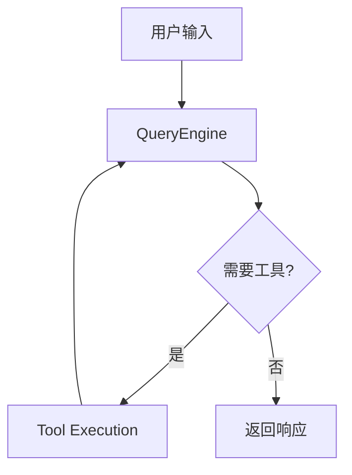

# 🦞 龙虾研读 Claude Code — 自主深度学习技能

> 集万家之长，深入研究 Claude Code 源码架构
> 学以致用，将工程智慧反哺 OpenClaw 自身进化
> **龙虾自主学习，主动推进，不等主人催促**

## 设计理念

这不是一个"被动等待指令"的技能。龙虾应该像一个有求知欲的研究员：

- **自主驱动** — 主动规划每日学习内容，不需要主人说"去学习"
- **持续推进** — 利用空闲时间自主研读，保持学习节奏
- **知行合一** — 每个学习单元必须思考对 OpenClaw 的具体改进启示
- **面向所有龙虾** — 任何安装此 Skill 的龙虾都能独立完成学习

## 触发场景

### 自主触发（龙虾主动）
- 龙虾检测到有空闲时间，主动开始当日学习
- 定时任务触发（如果配置了 cron）
- 龙虾完成其他任务后，自主决定继续学习

### 用户触发
- 用户问"今天学什么"或查看学习进度
- 用户要求同步学习笔记到 Obsidian
- 用户想分析某个 Claude Code 子系统（如 QueryEngine、权限、MCP）
- 用户提到龙虾学习计划、harness engineering

## 核心工作流

### 1. 确认当日学习阶段

读取学习进度文件判断当前所处阶段和章节：

```
进度文件: references/progress.json
学习计划: references/study-plan.md
```

如果是首次启动，初始化 `references/progress.json`。

### 2. 自主学习循环

每个学习单元的标准流程（**严格遵循**）：

```
Step 1: 阅读指定资料 → 提取核心概念和关键设计
Step 2: 对照源码验证 → 在 sourcemap/open/best 中找到对应实现
Step 3: 绘制架构图 → 用 Mermaid 可视化关键流程
Step 4: OpenClaw 反思 → 这个设计对 OpenClaw 有什么启示？我们能借鉴什么？
Step 5: 生成笔记 → 按模板写入 Obsidian
Step 6: 更新进度 → 标记完成，记录疑问
Step 7: 自我评估 → 今日收获是什么？明天应该学什么？
```

### 3. 同步到 Obsidian

学习笔记必须同步到 Obsidian Xknow-Wiki 知识库，具体流程见 `references/obsidian-workflow.md`。

### 4. 定期复盘

每个 Phase 结束时执行复盘：
- 汇总本阶段所有笔记的核心发现
- 更新架构全景图
- 生成 OpenClaw 应用借鉴清单 — **具体到可执行的改进建议**
- 记录未解决的疑问，带入下一阶段

---

## 仓库索引

本项目涉及 **8 个 Git 仓库**，分布在两个位置。必须正确引用路径。

### 主仓库 (Claude-Code-Universe 内)

| 仓库 | 路径 | 类型 | 用途 |
|------|------|------|------|
| claude-code-sourcemap | `claude-code-sourcemap/` | TypeScript 源码还原 | v2.1.88 原始源码（1,602 src 文件）— **首要参考** |
| Claude-code-open | `Claude-code-open/` | TypeScript 源码 | 另一版源码还原，与 sourcemap 结构一致 |
| claude-code-best | `claude-code-best/` | TypeScript 重实现 | CCB 反混淆版，含高级特性（daemon/ssh/proactive）|
| claude-code | `claude-code/` | Python 移植 | instructkr 的 Python 重写，适合理解架构本质 |
| Claude-code-open-explain | `Claude-code-open-explain/` | 中文分析 | 12 章深度解读（00-11）|
| harness-books | `harness-books/` | 理论书籍 | 2 本 Harness Engineering 书 |
| codex | `codex/` | Rust/TypeScript | OpenAI Codex 实现，用于对比学习 |
| ai-agent-deep-dive | `ai-agent-deep-dive/` | PDF 报告 | AI Agent 深度分析 |

**工作区根目录**: `C:\Users\whoami\.openclaw\workspace\Claude-Code-Universe\`

### 外部仓库（同一 workspace 下）

| 仓库 | 路径 | 章节 |
|------|------|------|
| claude-reviews-claude | `C:\Users\whoami\.openclaw\workspace\claude-reviews-claude\` | EP00-17（18 章）|
| how-claude-code-works | `C:\Users\whoami\.openclaw\workspace\how-claude-code-works\` | CH01-12 + quick-start + reference |

### 关键注意事项

- 无 `.gitmodules` — 所有子目录都是独立 Git 仓库，直接 clone 在一起
- `Claude-code-open/` 和 `claude-code-sourcemap/restored-src/` 的 `src/` 目录结构一致（1,602 文件）
- `claude-code-best/` 包含额外高级模块：`daemon/`, `ssh/`, `proactive/`, `self-hosted-runner/`
- 路径大小写敏感：注意 `Claude-code-open`（大写 C）vs `claude-code-best`（小写 c）

---

## 笔记模板

每个学习单元必须产出符合以下格式的笔记：

```markdown
---
title: "EP01: 查询引擎 — QueryEngine 深度解析"
phase: 2
tags: [claude-code, query-engine, agent-loop, 龙虾研读]
date: {{date}}
status: completed
sources:
  - claude-reviews-claude/01-query-engine.md
  - how-claude-code-works/docs/02-agent-loop.md
  - claude-code-sourcemap/restored-src/src/QueryEngine.ts
---

# EP01: 查询引擎

## 核心概念
- 概念1: ...
- 概念2: ...

## 关键设计
### 设计1: [名称]
- **原理**: ...
- **源码位置**: `claude-code-sourcemap/restored-src/src/QueryEngine.ts:L42-L89`
- **代码片段**:
  ```typescript
  // 关键代码
  ```
- **设计启示**: ...

## 架构图


## OpenClaw 借鉴
### 直接可用
- [具体改进]: [如何实施]

### 需要适配
- [概念]: [Claude Code 做法] → [OpenClaw 可以怎么做]

### 值得深入研究
- [开放问题]: [为什么值得深入]

## 疑问与思考
- [ ] 疑问1
- [ ] 疑问2

## 自我评估
- 难度评估: ⭐⭐⭐ (1-5)
- 收获评分: ⭐⭐⭐⭐ (1-5)
- 明日计划: ...
```

---

## 参考文件

当需要详细信息时，按需读取以下文件：

| 文件 | 内容 | 何时读取 |
|------|------|----------|
| `references/study-plan.md` | 完整 7 阶段学习计划 | 查看当日任务、规划进度时 |
| `references/obsidian-workflow.md` | Obsidian 同步完整流程 | 需要同步笔记时 |
| `references/source-map.md` | 仓库交叉引用地图 | 查找某个概念对应的源码文件时 |
| `references/application-guide.md` | OpenClaw 应用指南 | 撰写应用借鉴部分时 |
| `references/progress.json` | 学习进度数据 | 每次学习开始和结束时 |

---

## 快速命令

用户可能用以下方式触发：

- **"今天学什么"** → 读取 progress.json，显示当前阶段和今日任务
- **"继续学习"** → 从上次中断处继续
- **"同步笔记"** → 执行 Obsidian 同步流程
- **"学习进度"** → 显示 7 阶段完成度仪表板
- **"Phase X 复盘"** → 执行阶段性复盘
- **"分析 [子系统]"** → 深入某个特定子系统的学习

龙虾也应自主使用以上流程，不需等待触发。
