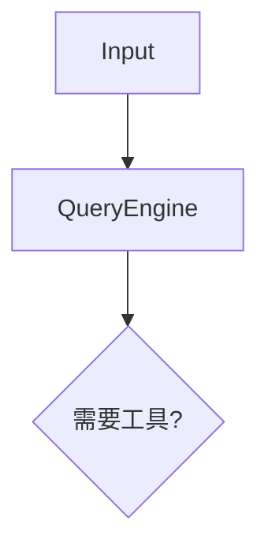

# Obsidian 同步工作流

> 学习成果 → Xknow-Wiki 知识库 → Obsidian 浏览

## Obsidian Vault 信息

- **Vault 路径**: `C:\Users\whoami\Obsidian\Xknow-Wiki\`
- **Vault 类型**: Xknow-Wiki（双层知识库：refs + concepts）
- **已有结构**:
  ```
  Xknow-Wiki/
  ├── .obsidian/        # Obsidian 配置
  ├── refs/             # 引用层 — 存放原始学习笔记
  │   └── notes/        # 笔记
  ├── concepts/         # 概念层 — 存放综合分析
  ├── raw/              # 原始材料
  │   ├── articles/
  │   ├── notes/
  │   ├── papers/
  │   └── repos/
  ├── INDEX.md          # 全局索引
  └── Latest-Synthesis.md
  ```

---

## 目录结构设计

在 Xknow-Wiki 中创建以下结构来存放 Claude Code 学习笔记：

```
Xknow-Wiki/
├── refs/
│   └── claude-code/              # 引用层：每日学习笔记
│       ├── phase1-architecture/
│       │   ├── day01-overview.md
│       │   ├── day02-harness-philosophy.md
│       │   └── day03-source-terrain.md
│       ├── phase2-core-loop/
│       │   ├── day04-query-engine.md
│       │   ├── day05-context-assembly.md
│       │   ├── day06-system-prompt.md
│       │   └── day07-review.md
│       ├── phase3-memory/
│       │   ├── day08-session-persistence.md
│       │   ├── day09-compact-system.md
│       │   ├── day10-memory-files.md
│       │   └── day11-openclaw-memory-design.md
│       ├── phase4-security/
│       │   ├── day12-permission-pipeline.md
│       │   ├── day13-sandbox-security.md
│       │   └── day14-openclaw-security.md
│       ├── phase5-tools/
│       │   ├── day15-tool-system.md
│       │   ├── day16-hooks-editing.md
│       │   └── day17-openclaw-tool-optimization.md
│       ├── phase6-extension/
│       │   ├── day18-multi-agent.md
│       │   ├── day19-mcp-plugins.md
│       │   └── day20-openclaw-multiagent.md
│       ├── phase7-engineering/
│       │   ├── day21-startup-bridge.md
│       │   ├── day22-ui-services.md
│       │   ├── day23-infrastructure.md
│       │   ├── day24-codex-comparison.md
│       │   └── day25-final-review.md
│       └── _index.md             # 本系列索引
│
├── concepts/
│   └── claude-code/              # 概念层：综合分析和设计方案
│       ├── architecture-panorama.md        # 架构全景图（持续更新）
│       ├── openclaw-memory-design.md       # OpenClaw 记忆架构方案
│       ├── openclaw-multiagent-design.md   # OpenClaw 多 Agent 方案
│       ├── openclaw-security-hardening.md  # OpenClaw 安全加固方案
│       ├── openclaw-tool-optimization.md   # OpenClaw 工具优化建议
│       ├── harness-engineering-essence.md  # Harness Engineering 精髓
│       └── claude-vs-codex-matrix.md       # 双系统对比矩阵
│
└── raw/
    └── repos/
        └── claude-code-universe.md  # 仓库清单和元信息
```

---

## 同步流程

### 每日同步（学习结束时执行）

```
Step 1: 生成笔记
  - 按 SKILL.md 中的笔记模板生成当日笔记
  - 确保包含: 核心概念、关键设计、架构图(Mermaid)、OpenClaw 借鉴、疑问

Step 2: 写入 refs 层
  - 将笔记写入: Xknow-Wiki/refs/claude-code/{phase-dir}/{day-file}.md
  - 路径: C:\Users\whoami\Obsidian\Xknow-Wiki\refs\claude-code\...
  - 确保 YAML frontmatter 完整（title, phase, tags, date, status, sources）

Step 3: 更新 refs 索引
  - 更新: Xknow-Wiki/refs/claude-code/_index.md
  - 添加当日笔记链接和一句话摘要

Step 4: 更新 concepts 层（如有综合输出）
  - Phase 复盘时更新 architecture-panorama.md
  - 产出设计方案时更新对应 concepts 文件
  - concepts 层文件使用 [[wiki-link]] 语法引用 refs 层笔记

Step 5: 更新全局索引
  - 更新 Xknow-Wiki/INDEX.md 中的 Claude Code 条目

Step 6: 更新进度
  - 更新 progress.json 中对应 day 的状态为 "completed"
  - 记录 notes_synced 数组
```

### Phase 复盘同步

每个 Phase 结束时的额外同步：

```
1. 汇总本 Phase 所有笔记中的"核心概念"
2. 更新 concepts/claude-code/architecture-panorama.md（追加本 Phase 发现）
3. 如果本 Phase 产出了设计方案，创建/更新对应 concepts 文件
4. 在 refs/claude-code/_index.md 中添加 Phase 复盘总结段落
5. 将关键发现记录到 progress.json 的 key_discoveries 数组
6. 汇总本 Phase 的 OpenClaw 改进建议
```

---

## 笔记模板

### refs 层笔记（每日学习）

```markdown
---
title: "Day 04: QueryEngine — Agent 核心循环解剖"
aliases: [QueryEngine, 查询引擎, Agent Loop]
phase: 2
day: 4
tags:
  - claude-code
  - 龙虾研读
  - query-engine
  - agent-loop
date: 2026-04-06
status: completed
sources:
  - "[[claude-reviews-claude/01-query-engine]]"
  - "[[how-claude-code-works/02-agent-loop]]"
  - "claude-code-sourcemap/restored-src/src/QueryEngine.ts"
---

# Day 04: QueryEngine — Agent 核心循环解剖

## 今日核心问题
1. while(true) 循环如何工作？
2. 状态机的转换条件是什么？
3. QueryEngine.ts 和 query.ts 如何分工？

## 核心概念
- **概念 1**: ...
- **概念 2**: ...

## 关键设计

### 设计 1: [名称]
- **原理**: ...
- **源码位置**: `src/QueryEngine.ts:L42-L89`
- **代码片段**:
  ```typescript
  // ...
  ```
- **设计启示**: ...

## 架构图



## OpenClaw 借鉴

### 🟢 直接可用
- ...

### 🟡 需要适配
- ...

### 🔵 值得研究
- ...

## 疑问与思考
- [ ] ...

## 自我评估
- 难度评估: ⭐⭐⭐ (1-5)
- 收获评分: ⭐⭐⭐⭐ (1-5)
- 明日计划: ...
```

### concepts 层笔记（综合分析）

```markdown
---
title: "Claude Code 架构全景图"
aliases: [架构全景, Architecture Panorama]
tags:
  - claude-code
  - 龙虾研读
  - architecture
  - concept
last_updated: 2026-04-06
---

# Claude Code 架构全景图

> 本文件随学习持续更新，记录对 Claude Code 架构的综合理解

## Phase 1 发现
...（Phase 1 结束后填写）

## Phase 2 发现
...（Phase 2 结束后填写）

## 最终架构图


## OpenClaw 改进汇总
- Phase 1: ...
- Phase 2: ...

## 相关笔记
- [[day01-overview]]
- [[day04-query-engine]]
...
```

### _index.md（系列索引）

```markdown
---
title: "🦞 龙虾研读 Claude Code — 学习索引"
tags: [claude-code, 龙虾研读, index]
---

# 🦞 龙虾研读 Claude Code

> 集万家之长，深入研究 Claude Code 源码架构
> 所有学习成果反哺 OpenClaw 自身进化

## 学习进度

| Phase | 主题 | 状态 | 天数 |
|-------|------|------|------|
| 1 | 架构概览 | ⬜ 未开始 | Day 1-3 |
| 2 | 核心循环 | ⬜ 未开始 | Day 4-7 |
| 3 | 记忆系统 | ⬜ 未开始 | Day 8-11 |
| 4 | 安全权限 | ⬜ 未开始 | Day 12-14 |
| 5 | 工具与执行 | ⬜ 未开始 | Day 15-17 |
| 6 | 扩展系统 | ⬜ 未开始 | Day 18-20 |
| 7 | 工程实践 | ⬜ 未开始 | Day 21-25 |

## 笔记列表

### Phase 1: 架构概览
- [[day01-overview|Day 1: 架构全景鸟瞰]]
- [[day02-harness-philosophy|Day 2: Harness Engineering 哲学]]
- [[day03-source-terrain|Day 3: 源码地形图]]

### Phase 2: 核心循环
- [[day04-query-engine|Day 4: QueryEngine 解剖]]
- [[day05-context-assembly|Day 5: 上下文装配]]
- [[day06-system-prompt|Day 6: System Prompt 深度]]
- [[day07-review|Day 7: 核心循环复盘]]

（后续 Phase 类似）

## 综合分析
- [[architecture-panorama|架构全景图]]
- [[openclaw-memory-design|OpenClaw 记忆架构方案]]
- [[openclaw-security-hardening|OpenClaw 安全加固方案]]
- [[claude-vs-codex-matrix|Claude Code vs Codex 对比矩阵]]
```

---

## Xknow-CLI 集成

如果 xknow-cli 可用，可以利用以下命令增强工作流：

```bash
# 将学习笔记编译到 refs 层
xknow compile --source raw/notes/ --target refs/claude-code/

# 从 refs 层合成 concepts
xknow compile --source refs/claude-code/ --target concepts/claude-code/

# 查询已学内容
xknow query "QueryEngine 的核心循环机制是什么？"

# 更新全局索引
xknow index
```

如果 xknow-cli 不可用，直接用文件写入完成同步即可。

---

## 重要路径汇总

| 用途 | 完整路径 |
|------|----------|
| Vault 根目录 | `C:\Users\whoami\Obsidian\Xknow-Wiki\` |
| 每日笔记 | `C:\Users\whoami\Obsidian\Xknow-Wiki\refs\claude-code\` |
| 综合分析 | `C:\Users\whoami\Obsidian\Xknow-Wiki\concepts\claude-code\` |
| 系列索引 | `C:\Users\whoami\Obsidian\Xknow-Wiki\refs\claude-code\_index.md` |
| 全局索引 | `C:\Users\whoami\Obsidian\Xknow-Wiki\INDEX.md` |
| 进度文件 | `<skill-dir>/references/progress.json` |
